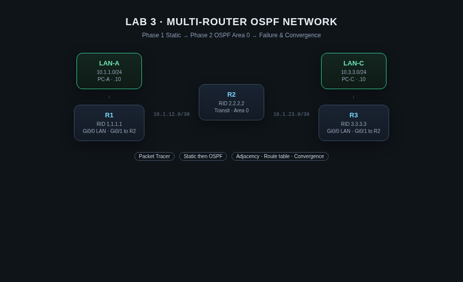

# LAB 3: Multi-Router OSPF Network

> **Routing intuition for NOC / Network Support interviews**  
> Static routes first. Then OSPF. Then break a link and watch the table change.

| Field | Detail |
| --- | --- |
| **Candidate** | [Kazi Nafis Nawaz](https://github.com/kn2702-sys) · MCA (Networking) |
| **Stack** | Cisco Packet Tracer · Static routing · OSPF Area 0 |
| **Why it exists** | Résumé claims static/dynamic routing — this lab proves path selection and convergence |
| **Series** | [LAB 1](https://github.com/kn2702-sys/enterprise-vlan-lab) · [LAB 2](https://github.com/kn2702-sys/dhcp-dns-failure-lab) · **LAB 3** |

Portfolio lab only — not a production employment claim.

---

## 1. Mission

Build a three-router backbone where **LAN-A** reaches **LAN-C** only through correct routing.

1. **Phase 1** — reachability with **static** routes  
2. **Phase 2** — remove statics; run **OSPF** (RID, Area 0, `network`, adjacency)  
3. **Phase 3** — shut an interface; observe adjacency, RIB, and convergence  

---

## 2. Topology



```text
LAN-A (10.1.1.0/24)
   |
  R1
   |
   +------ R2 ------ R3
                    |
                 LAN-C (10.3.3.0/24)
```

| Link | Network | R1 | R2 | R3 |
| --- | --- | --- | --- | --- |
| LAN-A | `10.1.1.0/24` | `.1` | — | — |
| R1–R2 | `10.1.12.0/30` | `.1` | `.2` | — |
| R2–R3 | `10.1.23.0/30` | — | `.1` | `.2` |
| LAN-C | `10.3.3.0/24` | — | — | `.1` |

Hosts: `PC-A = 10.1.1.10/24` gw `.1` · `PC-C = 10.3.3.10/24` gw `.1`

Router IDs: **R1 `1.1.1.1`** · **R2 `2.2.2.2`** · **R3 `3.3.3.3`**

---

## 3. Deliverables map

| Artifact | Role |
| --- | --- |
| [`configs/PHASE1-static/`](configs/PHASE1-static/) | Working static design |
| [`configs/PHASE2-ospf/`](configs/PHASE2-ospf/) | OSPF Area 0 replacement |
| [`docs/VERIFICATION.md`](docs/VERIFICATION.md) | `show` command checklist |
| [`docs/FAILURE-LAB.md`](docs/FAILURE-LAB.md) | Interface shutdown & convergence |
| [`docs/INTERVIEW.md`](docs/INTERVIEW.md) | Spoken answers |
| [`docs/BUILD.md`](docs/BUILD.md) | Packet Tracer build order |
| [`assets/screenshots/`](assets/screenshots/) | Proof captures (you add) |

---

## 4. Success criteria

**Phase 1**

- [ ] `PC-A` pings `PC-C`
- [ ] Each router has statics toward remote LAN(s)
- [ ] `show ip route` shows static (`S`) entries

**Phase 2**

- [ ] Static routes removed
- [ ] `show ip ospf neighbor` = FULL adjacency R1↔R2 and R2↔R3
- [ ] `show ip route` shows OSPF (`O`) paths to remote LANs
- [ ] `show ip protocols` lists OSPF process / RID / networks

**Phase 3**

- [ ] After `shutdown` on a serial/Ethernet WAN link: neighbor drops, route withdrawn or path changes
- [ ] Document recovery after `no shutdown`

---

## 5. Quick start

```text
1. Packet Tracer → 3 routers + 2 PCs (BUILD.md)
2. Load PHASE1 configs → verify end-to-end ping
3. Replace with PHASE2 OSPF → verify neighbors + O routes
4. Run FAILURE-LAB.md → capture screenshots
```

No `.pkt` in git. Configs are the source of truth.

---

## 6. Interview hooks (preview)

- What is OSPF?  
- Why OSPF over static at scale?  
- What is an OSPF neighbor?  
- What happens when a route/link goes down?  
- What is administrative distance?  

Full answers → [`docs/INTERVIEW.md`](docs/INTERVIEW.md)

---

## License

MIT © 2026 Kazi Nafis Nawaz · Contact: kn2702@srmist.edu.in · LinkedIn [kazi-nafis-nawaz-55b670393](https://www.linkedin.com/in/kazi-nafis-nawaz-55b670393)
